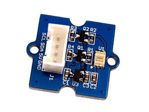
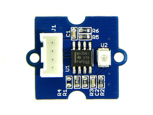

#Photonik Upgrade
Um eure SenseBox als Photonik Messstation nutzen zu können benötigt ihr neben der SenseBox Basic folgende Hardware:
##Sensoren

|||
|:--------:|:--------:|
|**Digital Light Sensor - Grove TSL2561**|**Grove UV Sensor - GUVA-S12D**|

##Aufbau
Auch hier ist der Aufbau, durch das einfache Stecksystem, kinderleicht. Nachdem ihr eure SenseBox Basic nach [dieser Anleitung](https://github.com/sensebox/OER/blob/master/SenseBoxBasic.md) zusammengebaut habt, müsst ihr lediglich noch die neuen Sensoren anschließen.
Der Digital Light Sensor wird an einen der I2C-Ports angeschlossen. Welchen ihr genau benutzt ist egal, da es sich um einen Datenbus handelt, an dem Sensoren parallel angeschlossen werden können.
Der UV-Sensor wird an den analogen Port A3 angeschlossen. Falls ihr hier einen anderen Port verwendet, müsst ihr diese Änderung auch im Sketch der SenseBox durchführen.

Zusammengefasst noch einmal die Ports:
- Digital Light Sensor:    I2C
- UV-Sensor:               A3

##Programmierung

Um den Code auf eurer SenseBox aktualisieren zu benötigt ihr wieder die Arduino Software Version 1.0.5 von der [offiziellen Homepage](http://www.arduino.cc). Auch der digitale Licht-Sensor benötigt eine eigene Repository, die ihr [HIER](http://www.seeedstudio.com/wiki/File:Digital_Light_Sensor.zip) herunterladen könnt. Benötigt wird die Digital_Light_Sensor.zip. Die heruntergeladene Datei entpackt ihr und kopiert sie in das Arduino Installationsverzeichnis. Eine detailliertere Anleitung zum Einbinden von Repositorys findet ihr [HIER](https://github.com/sensebox/OER/blob/master/SenseBoxBasic.md).
Nachdem die Repositorys hinzugefügt sind, müsst ihr nur noch den angepassten Code für das Photonik Upgrade herunterladen und mit Hilfe der Arduino IDE auf eure SenseBox übertragen. Wenn ihr nicht mehr genau wisst wie man einen Sketch auf die SenseBox überträgt schaut [HIER](https://github.com/sensebox/OER/blob/master/SenseBoxBasic.md) nach.

##Registrierung auf der [OpenSenseMap](www.opensensemap.org)

Zur Zeit müsst ihr leider nach dem Photonik Upgrade eine neue SenseBox anlegen. Wir arbeiten aber daran, dass ihr eure bestehende Sensebox einfach um die neuen Sensoren erweitern könnt. 

Eine neue Sensebox könnt ihr [HIER](http://opensensemap.org/#/register) registrieren. Klickt auf "Ich möchte eine neue SenseBox Basic anlegen!", füllt das Formular aus und fügt die folgenden beiden Sensoren hinzu:
- Licht (digital)         Einheit: Lux                   Typ: TSL2561
- UV                       Einheit: UV-Index Skala        Typ: GUVA-S12D

Klickt anschließend auf Speichern und die Einrichtung ist abgeschlossen.

Ihr könnt euch den Anmeldevorgang auch in unserem [Photonik-Upgrade Video](http://youtu.be/9OJruEILxqM) auf YouTube ansehen.

